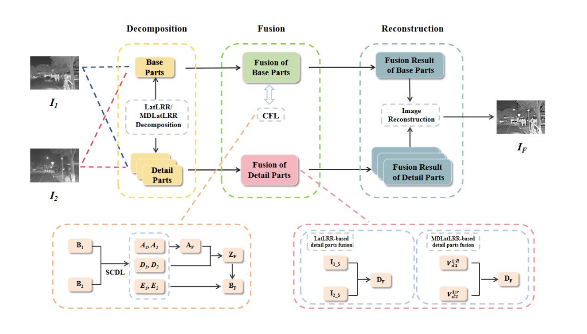
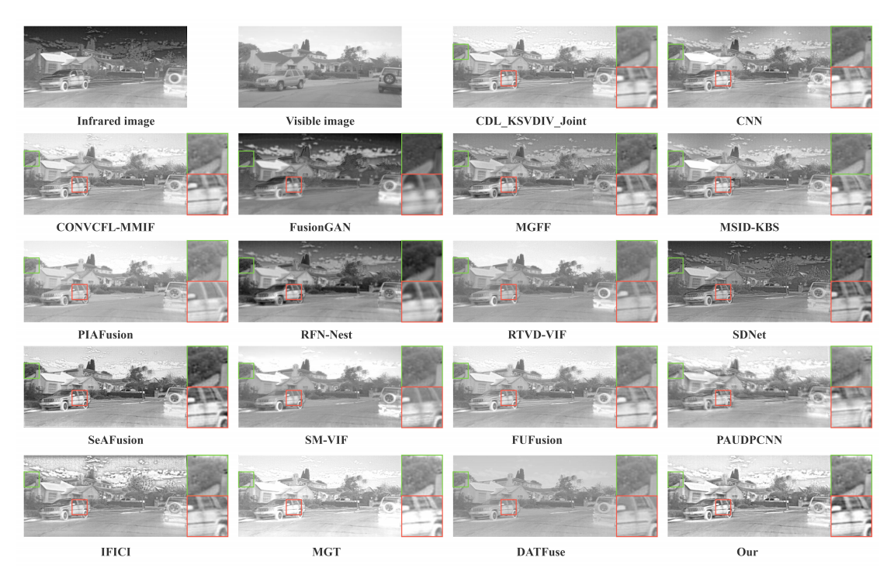
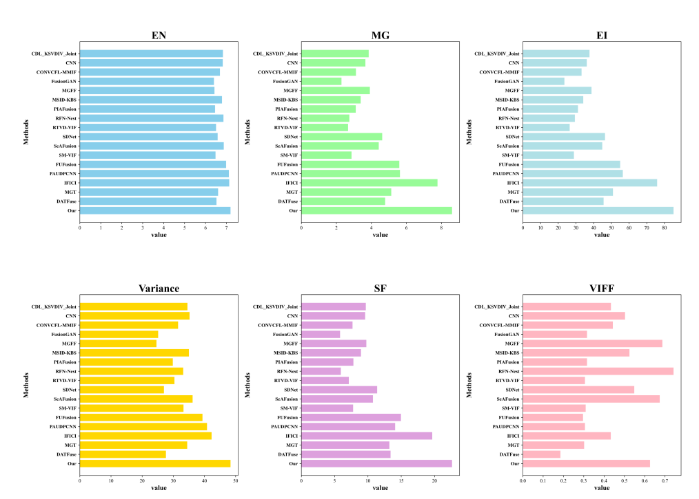

# Enhanced Infrared and Visible Image Fusion via Latent Low-Rank and Coupled Feature Learning
### This article is being submitted to The Visual Computer. 
### We sincerely appreciate your interest and support. The README will be further improved after acceptance.
### Progect Overview
Infrared and visible image fusion has gained significant attention in fields such as military surveillance, night-time driving, and medical diagnostics. Despite progress, existing methods based on Latent Low-Rank (LLR) and Coupled Feature Learning (CFL) often struggle with retaining detailed features and preserving high-frequency information, respectively. To address these limitations, we propose an enhanced fusion framework that integrates LLR and CFL techniques. Our approach decomposes source images into base and detail parts using LatLRR or MDLatLRR. The base parts, capturing global features, are fused using CFL to preserve structural information. The detail parts, retaining textures and edges, are fused through tailored strategies: summation for LatLRR details and nuclear norm for MDLatLRR details. Extensive experiments on the TNO and RoadScene datasets demonstrate that our method outperforms state-of-the-art techniques, achieving a significant improvement in fusion performance, with an average EN of 7.21 and MG of 7.64, highlighting its potential for practical applications. 
## Framework


## Environment Setup
#### OS Windows 10
#### CPU Intel Core i7
#### GPU NVIDIA RTX 3090 
#### MATLAB
## Datasets
#### TNO 
https://figshare.com/articles/dataset/TNO_Image_Fusion_Dataset/1008029
#### RaodSence 
https://github.com/jiayi-ma/RoadScene
## Result


## Citation
#### If you use this project's code,please cite our paper:
```bibtex
@article{xxx_2025_ME-PMA,
  title={Enhanced Infrared and Visible Image Fusion via Latent Low-Rank and Coupled Feature Learning},
  author={xxx},
  journal={The Visual Computer},
  volume={xx},
  number={x},
  pages={x--x},
  year={2025}
}


